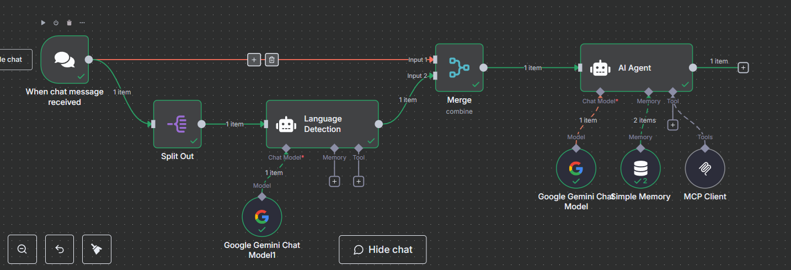

# Technical AI Engineer Test


## Engineering Knowledge AI Agent Test
1. Describe differences between REST API, MCP in the context of AI.
    ```
    In the context of AI, especially Generative AI, Tools are a feature that can be used to provide LLMs with **controllable** capabilities. Since the early of last year 2024, the way to go with these tools are combining Rest APIs with structured output. But at the end of 2024, a new methodology emerged called MCPs also gives LLM functionalities as tools.

    Then the question is why these MCP becomes so popular and widely adopted, sometimes replace the old REST API based tools is because it gives **flexibility** to the system.
    1. The concepts of MCP server and clients
        The changes made to the server directly reflected to all clients without any need of changes to them.
    2. Authentication served for secure tool calls
    ```
2. How REST API, MCP, can improve the AI use case.
    ```
    As mentioned in the answer in question no 1, MCPs and RestAPIs (served as tools) gives LLMs a fully controllable capabilities (deterministic functions)
    ```
3. How do you ensure that your AI agent answers correctly?
    ```
    LLM sometimes hallucinates, AI Agents which is basically specialized LLMs driven by system prompts will also sometimes hallucinates. The way to reduce the hallucinations when answering QnA are using RAG. But sometimes that is also not enough because, we, as engineer can say all day long about technicalities but customers will always ask back how do we know if the RAG is correct?

    To answer this we need an objective and measurable ways, called **Evaluation Metrics** and **Observabilities**. When Deep Learning faces same issues, Explanability emerges (Shap, Lime, etc) which shows us what metrics drive the model to return the outputs. Now for LLMs because we still waits for that exact explanabilities emerges (hopefully Anthropic and Meta will complete it as shown in some podcast), the only thing we can rely on is Evaluation metrics like relevance score, factual correctness and many more (See Ragas for more metrics). On the other hand Observability can be achieved by showing how the Agents arrived at the last question e.g., showing the process if it is agentic framework, show the source of the context if it is RAG system.
    ```
4. Describe what can you do with Docker / Containerize environment in the context of AI
    ```
    Usually i used the Docker environment for deploying the stacks i used, like database, rabbitmq, fastapi, celery workers and others. MCP server also is hosted in dockerize environment.
    ```
5. How do you finetune the LLM model from raw ?
    ```
    Using LoRA or QLoRA from Unsloth.
    ```

## Coding Test
1. Please parse this csv, get the insight of the data customer-100000.csv
2. Please parse large CSV, customers-2000000.csv and keep the memory low.
3. Explain how it's different from splitting the small vs large files.
    ```
    Refer to `notebook/no123.ipynb`
    ```
4. Deploy the vector DB on your own, and implement the `vector cosine similarity` without using a high level library.
    ```
    Refer to `notebook/no4.ipynb`
    ```
5. Create a platform with UI, for
a. Upload food online receipt
b. Extract with computer vision
c. Get the insight on the receipt, and store it to DB.
d. Design and implement the AI tools to make sure whenever user asking,
- “What food did i buy yesterday”
- “Give me total expenses for food on 20 June”
- “Where did i buy hamburger from last 7 day”
The LLM can answer it.
e. Wrap your application into a container image using docker, and run it in your
local.
f. Write CI/CD to wrap your application into the container. You can use
github-actions or gitlab-ci.

    ```
    git clone https://github.com/AlvinWenJH/expense-tracker.git
    cp .env.example .env
    docker-compose up -d
    ```
    Open up http://localhost:5678
    Login with :
    User: alvin.wenjianhong@gmail.com
    Pass: Secretpassword#123

    Go to Expense Tracker Workflow and Find the Chat link
    

    


